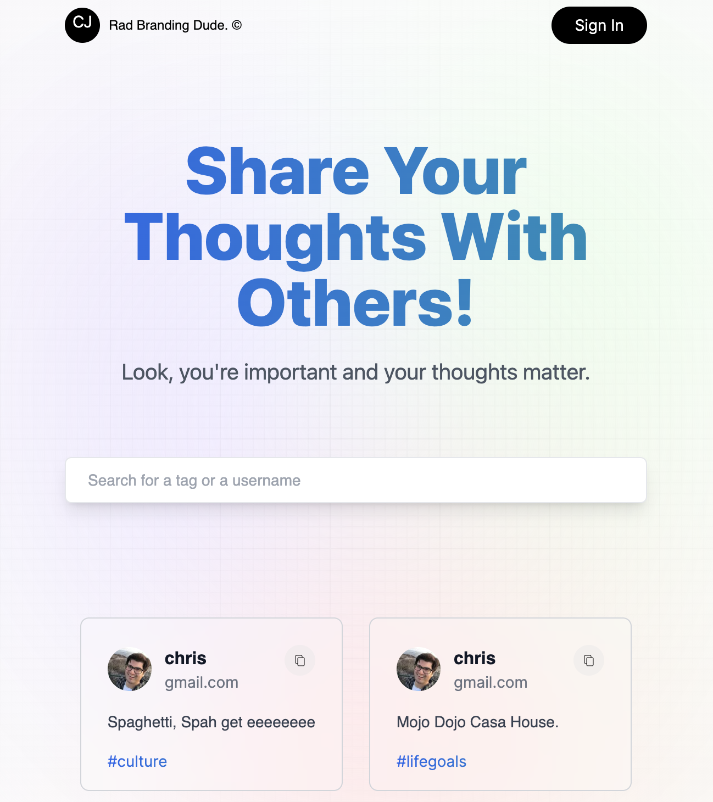

# Next Thoughts!
A Next.js app



## Getting Started

First, run the development server:

```bash
npm run dev
# or
yarn dev
# or
pnpm dev
```

Open [http://localhost:3000](http://localhost:3000) with your browser to see the result.


### Source
This site was initially made from this [tutorial](https://www.youtube.com/watch?v=wm5gMKuwSYk&list=LL&index=1)

