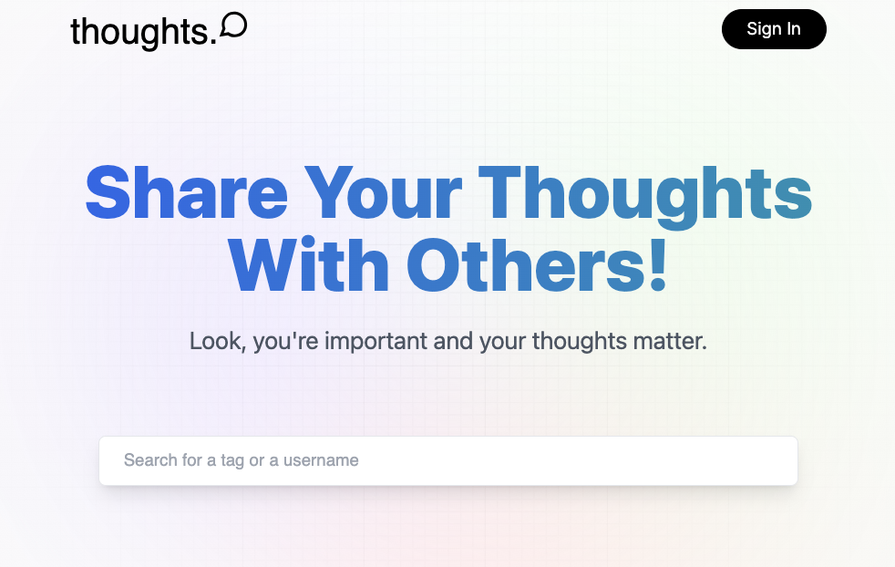

# Next Thoughts! [](https://github.com/cjvillar/NextThoughts/actions/workflows/test.yml)
A Next.js app
[THOUGHTS!](https://next-thoughts-ashen.vercel.app/)



## Getting Started

First, run the development server:

```bash
npm run dev
# or
yarn dev
# or
npm dev
```

Open [http://localhost:3000](http://localhost:3000) with your browser to see the result.

## Docker (Local Development)

Requires [Docker](https://www.docker.com/products/docker-desktop/) to be installed.

Copy the example env file and fill in your values:
```bash
cp .env.example .env.local
```

Start the app and local MongoDB:
```bash
docker compose up
```

Stop the containers:
```bash
docker compose down
```

Wipe the local database and start fresh:
```bash
docker compose down -v
```

## Testing
```bash
# Run tests once
npm test

# Watch mode
npm run test:watch
```

# .env.example
NEXTAUTH_SECRET=auth-secret
GOOGLE_ID=google-client-id
GOOGLE_CLIENT_SECRET=google-client-secret
NEXTAUTH_URL=http://localhost:3000


### Source
This site was initially made from this [tutorial](https://www.youtube.com/watch?v=wm5gMKuwSYk&list=LL&index=1)

